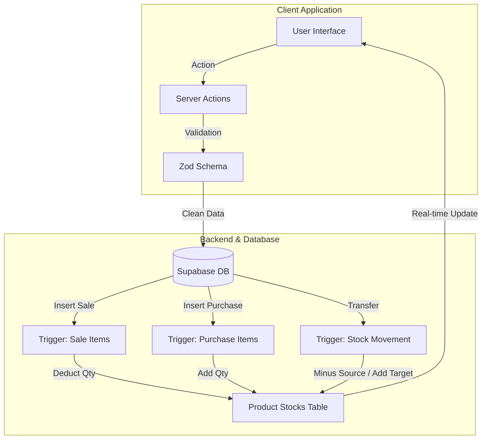

# 📦 SmartStock AI

> **The Intelligent Inventory & Business Management Solution**


SmartStock AI is a comprehensive, modern web application designed to streamline inventory management, sales tracking, and procurement processes for businesses. Built with performance and user experience at its core, it leverages **Next.js** for a lightning-fast frontend and **Supabase** for a robust, real-time backend.

---

## 🌟 Key Advantages

### ⚡ **Real-Time Data Synchronization**

Don't wait for refreshes. Stock levels, sales figures, and purchase orders are processed instantly using **Database Triggers**. Every sale automatically deducts from your specific warehouse inventory, and every purchase adds to it immediately.

### 🏭 **Multi-Warehouse Support**

Manage inventory across multiple locations effortlessly. Transfer stock between warehouses (`Stock Movements`), sell from specific locations, and track valuation per site.

### 💰 **Profit-First Logic**

Every transaction calculates profit in real-time. The system tracks your Cost Price vs. Selling Price per unit, giving you immediate insight into your `Gross Profit` on the dashboard.

### 🛡️ **Robust Validation & Safety**

Built-in safety checks prevent:

- ❌ Selling items that are out of stock.
- ❌ Negative inventory balances.
- ❌ Duplicate data entries.

---

## 🚀 Core Features

| Feature            | Description                                                                                      |
| :----------------- | :----------------------------------------------------------------------------------------------- |
| **📊 Dashboard**   | Visual overview of Total Revenue, Profit, and Low Stock Alerts.                                  |
| **📦 Inventory**   | centralized product management with categories, barcodes, and pricing.                           |
| **🛒 Sales Point** | Streamlined interface to process customer sales. Checks stock availability in real-time.         |
| **🚚 Purchases**   | Manage supplier orders. Updating a generic "received" status automatically fills your warehouse. |
| **🏢 Warehouses**  | Create and manage multiple physical storage locations.                                           |
| **🔄 Movements**   | Transfer goods between warehouses with audit logs (`Stock Movements`).                           |
| **👥 User Roles**  | Granular permissions for Admins, Managers, and Cashiers.                                         |

---

## 🔄 Data Architecture & Flow

SmartStock AI uses a centralized **PostgreSQL** database where logic is enforced at the data layer for maximum reliability.



### **How it works:**

1.  **User Action**: A user submits a form (e.g., "New Sale").
2.  **Server Action**: Next.js receives the request and validates inputs using **Zod**.
3.  **Database Transaction**: The record is inserted into `sales` and `sale_items`.
4.  **Automatic Triggers**: PostgreSQL triggers (`decrease_stock_after_sale`) automatically fire, efficiently updating the `product_stocks` table without extra API calls.
5.  **Revalidation**: The UI automatically updates via `revalidatePath` to show the fresh data instantly.

---

## 🛠️ Technology Stack

- **Framework**: [Next.js 15 (App Router)](https://nextjs.org/)
- **Language**: TypeScript
- **Styling**: Tailwind CSS & Shadcn/UI
- **Backend**: Supabase (PostgreSQL, Auth, Realtime)
- **Icons**: Lucide React
- **Forms**: React Hook Form & Zod
- **Animations**: Tailwind Animate

---

## 💻 Getting Started

1.  **Clone the repository**

    ```bash
    git clone https://github.com/yourusername/smart-stock-ai.git
    cd smart-stock-ai
    ```

2.  **Install dependencies**

    ```bash
    npm install
    # or
    bun install
    ```

3.  **Environment Setup**
    Create a `.env.local` file with your Supabase credentials:

    ```env
    NEXT_PUBLIC_SUPABASE_URL=your_url_here
    NEXT_PUBLIC_SUPABASE_ANON_KEY=your_key_here
    ```

4.  **Run the application**
    ```bash
    npm run dev
    ```

---

## 🔐 Security & Permissions

Access is controlled via Supabase Row Level Security (RLS) policies and app-level permission checks.

- **Admin**: Full access to all modules.
- **Manager**: Can manage inventory and views reports, but limited system settings.
- **Cashier**: Restricted to Sales and Inventory viewing.

---

<p align="center">
  <i>Developed with ❤️ for efficient business operations.</i>
</p>
